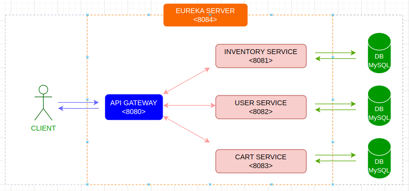
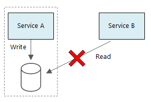

# Shopping Cart Web App - REST Microservices architecture
Simple online shopping cart web application to manage a shopping cart for users. (backend only).

- [System Design](#system-design)
  - [1. Description](#1-requirements)
  - [2. High-level design](#2-high-level-design)
  - [3. Defining data model](#3-defining-data-model)
    - [Product Service](#product-service)
    - [Audit Service](#audit-service)
    - [Shopping Cart Service](#shopping-cart-service)
    - [Order Service](#order-service)
  - [4. Detailed design](#4-detailed-design)
    - [Authentication Service](#authentication-service)
    - [API Gateway](#api-gateway)
    - [Registry Service](#registry-service)
    - [Product Service](#product-service)
    - [Audit Service](#audit-service)
    - [Shopping Cart Service](#shopping-cart-service)
    - [Order Service](#order-service)
  - [5. Monitoring](#5-monitoring)
  - [6. Identifying and resolving single point of failures and bottlenecks](#6-identifying-and-resolving-single-point-of-failures-and-bottlenecks)
    - [Single point of failure](#single-point-of-failure)
    - [Bottlenecks](#bottlenecks)
- [Software development principles](#software-development-principles)
  - [KISS (Keep It Simple Stupid)](#kiss-keep-it-simple-stupid)
  - [YAGNI (You aren't gonna need it)](#yagni-you-arent-gonna-need-it)
  - [Separation of Concerns](#separation-of-concerns)
  - [DRY](#dry)
  - [Code For The Maintainer](#code-for-the-maintainer)
  - [Avoid Premature Optimization](#avoid-premature-optimization)
  - [Minimise Coupling](#minimise-coupling)
  - [Inversion of Control](#inversion-of-control)
  - [Single Responsibility Principle](#single-responsibility-principle)
- [Design Patterns](#design-patterns)
- [Application default configuration](#application-default-configuration)
- [How to run the application](#how-to-run-the-application)
  - [Setup development workspace](#setup-development-workspace)
  - [Run a microservice](#run-a-microservice)
- [API Documentation](#api-documentation)
- [Project folder structure and Frameworks, Libraries](#project-folder-structure-and-frameworks-libraries)
  - [Project folder structure](#project-folder-structure)
  - [Frameworks and Libraries](#frameworks-and-libraries)
- [References](#references)
- [Other projects](#other-projects)

## System Design

### 1. Requirements
1. Created an Auth instance using Spring security And create another service instance that can be cart service.
2. Can add item to the shopping cart
3. Can remove item from the shopping cart.
4. Manage communication between services that created.
5. Can create roles and there is an admin roles to add items to the site. (To manage the inventory)
6. Used Mysql database manage with ORM

### 2. High-level design
At a high-level, we need some following services (or components) to handle above requirements:



- **Inventory Service**: Add item to the site, only admin role can manage the inventory.
- **User Service**: manage all users service and create new users
- **Cart Service**: manages customers shopping carts with CRUD operations.
- **API Gateway**: Route requests to multiple services using a single endpoint. This service allows us to expose multiple services on a single endpoint and route to the appropriate service based on the request.

### 2. Defining data model
   In this part, we describe considerations for managing data in our architecture. For each service, we discuss data schema and datastore considerations.

   In general, we follow the basic principle of microservices is that each service manages its own data. Two services should not share a data store.
   

#### Cart Service
The Cart service stores information about cart of the customers. The storage requirements for the Shopping Cart Service are:
- Short-term storage. Each customer will have their own shopping cart and only one shopping cart at the moment. After customer checkout, the shopping cart data will be cleared.
- Need retrieve/lookup shopping cart data quickly and update shopping cart data quickly.

#### API Gateway
We need API Gateway for following reasons:
- When a client needs to consume multiple services, setting up a separate endpoint for each service and having the client manage each endpoint can be challenging. Each service has a different API that the client must interact with, and the client must know about each endpoint in order to connect to the services. If an API changes, the client must be updated as well. If we refactor a service into two or more separate services, the code must change in both the service and the client.
- Simplify application development by moving shared service functionality, such as the use of SSL certificates, from other parts of the application into the gateway. Other common services such as authentication, authorization, logging, monitoring, or throttling can be difficult to implement and manage across a large number of deployments. It may be better to consolidate this type of functionality, in order to reduce overhead and the chance of errors. Simpler configuration results in easier management and scalability and makes service upgrades simpler.
- Provide some consistency for request and response logging and monitoring.

#### Registry Service
We use *spring-cloud-starter-netflix-eureka-server* to start Eureka Server for service registration and discovery in our system. It helps API Gateway routing requests by service name instead of hard-code URL.


## Software development principles
### KISS (Keep It Simple Stupid)
- Most systems work best if they are kept simple rather than made complex.
- Less code takes less time to write, has less bugs, and is easier to modify.
- > The best design is the simplest one that works - Albert Einstein.

**What applied:** Keep system design and the implementation code simple

### YAGNI (You aren't gonna need it)
- Don't implement something until it is necessary.
- Any work that's only used for a feature that's needed tomorrow, means losing effort from features that need to be done for the current iteration.

**What applied:** Always implement things when we actually need them, never when we just foresee that we need them.

### Separation of Concerns
- Separating a system into multiple distinct microservices, such that each service addresses a separate concern (inventory, user, cart...).
- In each service, break program functionality into separate layers.
- AOP to separate of cross-cutting concerns.

### DRY
- Put business rules, long expressions, if statements, math formulas, metadata, etc. in only one place.

### Code For The Maintainer
- Maintenance is by far the most expensive phase of any project.
- Always code as if the person who ends up maintaining your code is a violent psychopath who knows where you live.
- Always code and comment in such a way that if someone a few notches junior picks up the code, they will take pleasure in reading and learning from it.

**What applied:** Comprehensive documentation, make the code clean, add comment for some special intentions.

### Minimise Coupling
- Eliminate, minimise, and reduce complexity of necessary relationships.
- By hiding implementation details, coupling is reduced.

**What applied:** Encapsulation in OOP, DI in Spring.

### Inversion of Control
IoC inverts the flow of control as compared to traditional control flow (Don't call us, we'll call you).
- In traditional programming: our custom code makes calls to a library.
- IoC: framework make calls to our custom code.

**What applied:** Spring IoC container with Constructor-Based Dependency Injection for main code and Field-Based Dependency Injection for test code.

### Single Responsibility Principle
Every class should have a single responsibility, and that responsibility should be entirely encapsulated by the class. Responsibility can be defined as a reason to change, so a class or module should have one, and only one, reason to change.

**What applied:** break system into multiple services, each services has only one responsibility. In each services, break into multiple layers, each layers were broken into multiple classes, each class has only one reason to change.

## Design Patterns
- **Singleton Design Pattern**
- **DTO Design Pattern**
- **Facade Design Pattern**
- **Strategy Design Pattern**

## Application default configuration
To make it easier for development process, we still expose these ports on the local machine to send request directly with services or to view actual data in the data stores. 
In production environment, we leverage the infrastructure to make the downstream services become unreachable from the client, we only expose one single point - API Gateway.

| Service               | Port |
|-----------------------| --   |
| api-gateway           | 8080 |
| inventory-service     | 8081 |
| user-service          | 8082 |
| cart-service          | 8083 |
| discovery-service     | 8084 |

_Note_: for development purpose, we could bypass authentication by adding "Username: ```<your-test-username>```" to HTTP Header when we send request to downstream services.

## How to run the application
### Setup development workspace
The setup development workspace process is simpler than ever with following steps:
1. Install [JDK 17](https://www.oracle.com/java/technologies/javase/jdk17-archive-downloads.html).
1. Install [Maven](https://maven.apache.org/download.cgi?Preferred=ftp://mirror.reverse.net/pub/apache/).
1. Install MySQL.
1. Clone this project to your local machine.
1. Open the pom.xml file and open as a project using Intellij IDEA.

That's all.

### Run a microservice
You can run Spring Boot microservice in different ways, but first make sure you are in the root directory of the microservice you want to run:
- Run jar file (of course you need to build it first): ```mvn install && java -jar target/<service-name>-1.0.0.jar```
- Run with Spring Boot: ```mvn spring-boot:run```

## Project folder structure and Frameworks, Libraries
### Project folder structure
Based on above design, the project folder structure is organized following:
- api-gateway: API Gateway
- inventory-service: Inventory Service
- external-files: external files
- user-service: User Service
- cart-service: Cart Service

For each microservice, we will follow common 4 layers architecture:
- **Controller**: Handle HTTP request from client, invoke appropriate methods in service layer, return the result to client.
- **Service**: All business logic here. Data related calculations and all.
- **Repository**: all the Database related operations are done here.
- **Entity**: persistent domain object -  table in Databases.

### Frameworks and Libraries
The Frameworks/Libraries used in the project and their purposes:
- spring-cloud-starter-netflix-eureka-server : Eureka Server (Registry Service). This library allows services to find and communicate with each other without hard-coding hostname and port.
- spring-cloud-starter-netflix-eureka-client : Eureka Client, for registering the service with Service Registry.
- spring-boot-starter-web : for building REST API.
- spring-boot-starter-test : Starter for testing Spring Boot applications with libraries including JUnit, Hamcrest and Mockito.
- spring-boot-starter-aop : for aspect-oriented programming with Spring AOP and AspectJ. We use this feature for implementing the customer audit feature.
- spring-boot-starter-data-jpa: for using Spring Data JPA with Hibernate.
- spring-boot-starter-validation: for using Java Bean Validation with Hibernate Validator.
- spring-boot-starter-security: for using Spring Security.
- spring-security-test: for the testing Spring Security.
- modelmapper: to make object mapping easy, by automatically determining how one object model maps to another, based on conventions.

## References
- [Designing a microservices architecture](https://docs.microsoft.com/en-us/azure/architecture/microservices/design/) - *Azure Architecture Center | Microsoft Docs*
- [Cloud design patterns](https://docs.microsoft.com/en-us/azure/architecture/patterns/) - *Azure Architecture Center | Microsoft Docs*
- [The System Design Primer](https://github.com/donnemartin/system-design-primer)

